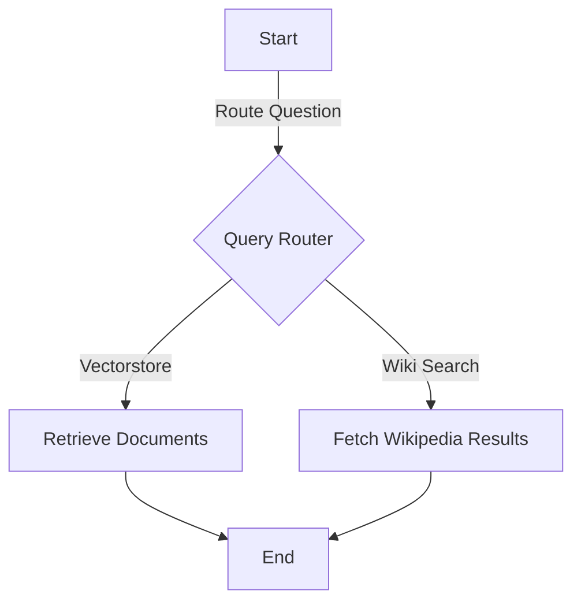

# LangChain-Based-Query-Routing-and-Document-Retrieval-Pipeline
This project implements a query routing and document retrieval pipeline using LangChain. It dynamically routes queries to either Wikipedia or a vector database, retrieving the most relevant documents based on the question context.

## Features

- **Intelligent Query Routing**: Routes user queries to either a vector database or Wikipedia based on relevance.
- **Vectorstore Retrieval**: Uses Cassandra-based vector storage for efficient semantic search.
- **Wikipedia Search**: Fetches concise summaries for general knowledge questions.
- **Graph Workflow**: Manages the query flow with a modular state graph.

---

## Installation

Install the required dependencies:

```bash
pip install langchain langchain_community cassio chromadb langgraph langchain_huggingface arxiv wikipedia
```
---## Components

### 1. Query Routing
- Determines whether the user query should be routed to a vectorstore or Wikipedia based on context.
- Powered by an LLM that classifies the query into either `vectorstore` or `wiki_search`.

### 2. Vectorstore Retrieval
- Connects to a Cassandra-based vector database.
- Retrieves semantically relevant documents using precomputed embeddings from HuggingFace's `all-MiniLM-L6-v2`.

### 3. Wikipedia Search
- Fetches concise summaries of topics from Wikipedia.
- Useful for general knowledge questions unrelated to the indexed vectorstore content.

### 4. Workflow Graph
- Manages the flow of query processing.
- Routes the query to the appropriate retrieval system and returns results to the user.

---

## Workflow Diagram


---
## How to Run

## 1. Setup

```
ASTRA_DB_APPLICATION_TOKEN = "<Your Astra DB Token>"
ASTRA_DB_ID = "<Your Astra DB ID>"
```
## 2.Workflow Execution

Run the graph workflow with a query. For example:

```
inputs = {"question": "What is agent?"}
for output in app.stream(inputs):
    for key, value in output.items():
        print(f"Node '{key}':")
```

## 3. Final Output

Retrieve the documents or summaries based on the query:
```
print(value['documents'])
```
---
## Example Usage

## Run a Query Through the Workflow
To execute the workflow, provide a question as input and let the system decide whether to fetch documents from the vectorstore or perform a Wikipedia search.

### Code Example
```python
inputs = {
    "question": "What is prompt engineering?"
}

for output in app.stream(inputs):
    for key, value in output.items():
        print(f"Node '{key}': {value}")
    print("\n---\n")
```
### Example Output
```
{
  "question": "What is agent memory?",
  "documents": [
    {
      
      "content": "Explanation of agent memory types...",
      
      "source": "https://lilianweng.github.io/posts/2023-06-23-agent/"
    }
  ]
}
```
```
{
  "question": "Who is Shahrukh Khan?",
  "documents": [
    {
      "content": "Shahrukh Khan is a Bollywood actor...",
      "source": "Wikipedia"
    }
  ]
}
```

---

## Dependencies

To set up and run the workflow, the following Python libraries are required:

### Core Libraries
- `langchain`: For building language model workflows.
- `langchain_community`: For accessing community-contributed loaders and utilities.
- `cassio`: To integrate with Cassandra for vector storage.
- `chromadb`: For vector database operations.
- `langgraph`: To define and execute state graph workflows.

### Additional Libraries
- `langchain_huggingface`: For embedding generation using HuggingFace models.
- `arxiv`: To fetch academic documents from arXiv.
- `wikipedia`: For querying Wikipedia pages and summaries.

### Installation
Install all dependencies using pip:
```bash
pip install langchain langchain_community cassio chromadb langgraph langchain_huggingface arxiv wikipedia
```

